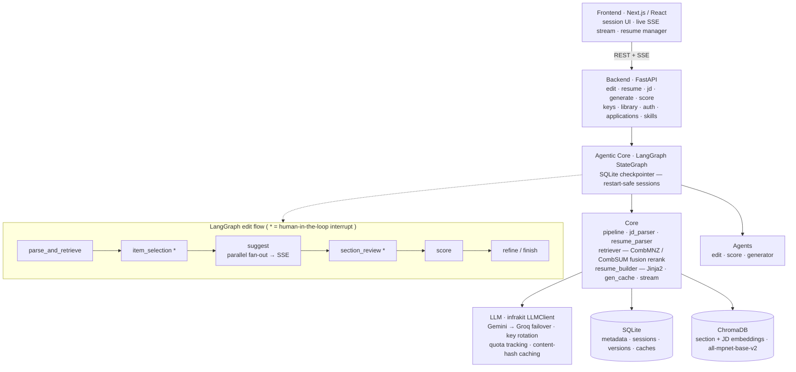
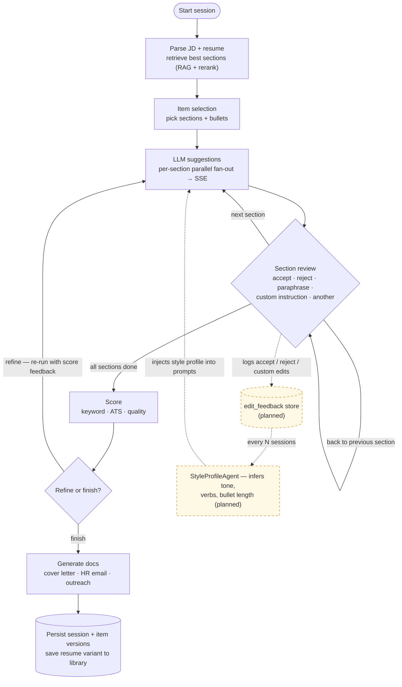

# Job Assistant

An AI-powered resume tailoring and job application assistant. Add your resume, paste a job description (or a job-post URL), and the system retrieves the most relevant sections from your resume history, lets you review AI-suggested edits section by section, scores the result, generates a cover letter / HR email / outreach message, and tracks the application — all from a React frontend over a FastAPI + LangGraph backend.

---

## Architecture

> Rendered diagram (GitHub renders Mermaid natively; in VS Code use the *Markdown Preview Mermaid Support* extension).



## Workflow

End-to-end session flow, including back-navigation, the refine loop, and the **planned**
adaptive feedback loop (dashed amber) that learns your editing style over time.



---

## Features

### Resume Parsing & Storage
- Parse a `.tex` resume with an LLM — extracts structured sections (experience, projects, skills, education, achievements, coursework). Manual entry is also supported.
- Each section and section-item is stored in SQLite and embedded into ChromaDB for semantic retrieval
- Multiple resume versions for the same user are supported; the system automatically picks the most JD-relevant version of each section

### JD Parsing
- Extracts role, company, required skills, nice-to-have skills, and responsibilities from raw JD text
- **JD from URL** — paste a job-post link and the JD text is extracted automatically (Jina Reader)
- De-duplicates JDs by content hash so parsing only runs once per unique JD
- Embeds the JD into ChromaDB for retrieval queries

### Semantic Retrieval (RAG)
- Queries ChromaDB with the JD skills + responsibilities as query texts
- Two-stage fusion reranking: CombMNZ within groups (required skills, responsibilities, nice-to-have) then weighted CombSUM across groups
- Retrieval is scoped per user — picks the best version of each section across all of that user's resume history

### Interactive Editing Session (LangGraph)
- Section-by-section AI edit suggestions with side-by-side diff view
- Suggestions are generated by a **per-section parallel fan-out** and **streamed live over SSE** as each section completes
- LLM returns **all improvable lines** per section (not just the most obvious one)
- **Per-change selection** — each suggested line change has its own checkbox; accept the ones you want and skip the rest. The preview updates live to reflect your selection
- Actions per section: **Accept** (all or selected changes), **Reject**, **Paraphrase**, **Custom instruction**, **Another suggestion**
- Full edit history per section with one-click restore to any previous version (including partial-accept snapshots)
- Back-navigation to re-review previous sections
- Multi-cycle support: after all sections the system scores the result, then offers a **Refine** pass (re-runs the LLM with score feedback) or **Finish**
- Sessions are checkpointed to SQLite, so they **survive server restarts** and can be reopened later

### Resume Scoring
- Three dimensions: **Keyword Match** (coverage + embedding similarity), **ATS Friendliness** (LLM), **Resume Quality** (LLM)
- Per-dimension scores, reasoning, and improvement suggestions
- Missing required keywords highlighted

### Document Generation
- Generate **Cover Letter**, **HR Email**, and **Outreach Message** at any point:
  - **Quick Generate** — skip editing entirely; uses JD-similarity to auto-select the best sections
  - **Session Generate** — generate using the tailored resume from an active editing session
  - **Post-session Generate** — generate after finishing the editing session
- All document types are generated **in parallel** (ThreadPoolExecutor) — requesting all three takes no longer than the slowest single generation
- **Generation cache** — results are cached in SQLite keyed by a hash of `(JD, resume, type, instruction, no_jd)`

### Resume Library & Variants
- Save any tailored resume as a named **variant** to a personal library
- **Search the library by JD** — ranks saved variants by embedding similarity to a new job
- Download any variant as `.tex` or `.pdf`

### Templates & Layout
- **Jinja2 template engine** decouples resume content from presentation
- Multiple templates: **Classic** (FontAwesome header) and **ATS Minimal** (plain, scanner-safe)
- Live layout controls on the resume detail and session-finish screens: **template**, **section order**, **font size**, **margins** — with an instant PDF preview, then download `.tex` / `.pdf`

### Bullet-Level Granularity
- Flat sections and atomic items split into individual bullets, each embedded separately
- Pre-LLM bullet filter (send only selected bullets) + LLM-suggested bullet drops
- Per-bullet keep/drop decisions during section review

### One-Page Optimizer
- Automatic drop-loop + condensation to fit a target page count
- Compiles, counts pages, and removes lowest-ranked items until it fits

### Authentication
- Google OAuth (JWT in an httpOnly cookie); dev mode falls back to a fixed user id

### Application Tracker (Kanban)
- Track each application: **Applied → Phone Screen → Technical → Offer / Rejected**
- Each card links the resume variant + generated documents used, with follow-up dates

### Job Intelligence
- **Skill-gap analysis** — required skills across all your JDs vs. your resume skills, ranked by frequency
- **Interview prep** — likely questions + talking points grounded in your resume against the JD
- **LinkedIn generator** — About / Headline / Experience bullets via the same JD-tailoring logic

### Full LaTeX Preview
- Compile the resume to PDF at any point during or after editing (`GET /edit/{tid}/preview`, `GET /resume/{id}/preview`)
- Rendered inline in the browser (PDF iframe); `.tex` / `.pdf` export available at every stage
- **Compile cache** — identical LaTeX is never sent to `pdflatex` twice; results are cached by content hash

### Performance & Caching

All expensive operations are cached to minimise repeated LLM and compute calls:

| Layer | Cache type | Key |
|---|---|---|
| Document generation | SQLite (persistent, cross-session) | SHA-256 of `(JD, resume, type, instruction, no_jd)` |
| Edit suggestions | SQLite (persistent) | SHA-256 of `(resume_latex, jd_hash)` |
| Resume scoring | In-memory LRU (64 entries) | SHA-256 of `(resume_latex, jd)` |
| Sentence-transformer embeddings | `functools.lru_cache` (256 entries) | Embedding input text |
| ChromaDB retrieval | In-memory dict (process lifetime) | `(job_id, sorted resume_ids)` |
| LaTeX → PDF compilation | In-process, by content hash | Full LaTeX string |
| JD parsing | SQLite (raw + parsed content hash) | Built into `JDParser.run()` |

---

## Roadmap (planned / in progress)

- **Adaptive writing style** — log every accept / reject / custom-instruction decision; a `StyleProfileAgent`
  infers your style (tone, action verbs, bullet length) after every few sessions and injects it into all edit
  prompts. This is the dashed amber loop in the [Workflow](#workflow) diagram.
- **Job feed / recommendations** — surface matching jobs from your stored skills + JD history, ranked by resume-fit score.
- **Browser extension** — sidebar on LinkedIn / Indeed that extracts the JD and quick-generates in place.
- **Email-to-JD**, **salary-range lookup**, and **PWA + mobile install / public hosting**.

---

## Requirements

| Tool | Purpose |
|---|---|
| Python ≥ 3.13 | Backend runtime |
| [uv](https://docs.astral.sh/uv/) | Python package manager (replaces pip/venv) |
| Node.js ≥ 18 | Frontend (Next.js) |
| MiKTeX or TeX Live | LaTeX → PDF compilation (optional — preview / export) |

API keys in `.env`:
- `GEMINI_API_KEY` — primary LLM (parsing, editing, scoring, generation)
- `GROQ_API_KEY` — optional fallback provider for rate-limit overflow
- `HUGGING_FACE_TOKEN` — for the `all-mpnet-base-v2` sentence-transformer embeddings

---

## Setup

```bash
# 1. Clone
git clone <repo-url>
cd job-assistant

# 2. Copy and fill in the environment file
cp .env.example .env
# Edit .env — set GEMINI_API_KEY, HUGGING_FACE_TOKEN, BASE_DIR, etc.

# 3. Install backend dependencies
uv sync

# 4. Initialise the database and run migrations
uv run python db/init_db.py
uv run python db/migrate.py

# 5. Install frontend dependencies
cd frontend && npm install && cd ..
```

---

## Starting the App

Open two terminals:

```bash
# Terminal 1 — FastAPI backend
uv run uvicorn app.api.main:app --reload

# Terminal 2 — Next.js frontend
cd frontend
npm run dev
```

- Frontend: `http://localhost:3000`
- API docs (Swagger): `http://localhost:8000/docs`

> **Open the app at `http://localhost:3000`** — not your machine's LAN IP. The frontend calls the
> backend at `http://localhost:8000`, so loading the UI from a different host or device makes those
> calls resolve to the wrong machine and every page hangs on loading.

---

## How to Use

### 1. Add your resume — `/resume/new`
- **Upload** a `.tex` file (the LLM parses it into structured sections) or **enter manually**.
- Review/edit the parsed personal info + sections, then **Save** to your library.

### 2. Start a tailoring session — `/session/new`
- Paste a job description, or a job-post **URL** (the JD is extracted automatically), and pick a saved resume.
- The system parses the JD, retrieves your most JD-relevant sections, and opens the editing loop.

### 3. Review & edit — `/session/[threadId]`
- Pick the sections / bullets to include, then review LLM suggestions section by section
  (accept / reject / paraphrase / custom instruction / another), with live diff and per-change selection.
- Suggestions stream in as they are generated (SSE).

### 4. Score, refine, finish
- View the ATS / keyword / quality score, optionally **Refine** (re-run with score feedback), then **Finish**.
- Customise template + layout, save the result as a **variant**, and download `.tex` / `.pdf`.

### 5. Generate documents
- At any point, generate a **cover letter**, **HR email**, and **outreach message** — individually or all in parallel.

### Other pages
- `/resume/library` — saved variants, JD-based search, download
- `/tracker` — Kanban application tracker
- `/skills` — skill-gap analysis across your JD history
- `/settings` — API-key management + per-key usage dashboard

---

## Running Tests

```bash
uv run pytest tests/
```

To reset the test database:
```bash
uv run python tests/resetdb.py
```

---

## File & Folder Reference

```
job-assistant/
│
├── frontend/                 # Next.js + React (TypeScript, Tailwind) UI
│   └── src/
│       ├── app/              # routes: / · session · sessions · resume ·
│       │                     #   tracker · skills · settings · login
│       ├── components/       # session / resume / layout / ui components
│       └── lib/              # api.ts · auth.ts · types.ts
│
├── main.py                   # Thin entry point (imports the FastAPI app)
│
├── app/
│   ├── api/
│   │   ├── main.py           # FastAPI app, router registration, CORS, /health
│   │   ├── middleware.py     # get_current_user dependency (dev fallback to user 1)
│   │   ├── deps.py           # Shared FastAPI dependencies
│   │   └── routes/           # edit · resume · jd · generate · score · keys ·
│   │                         #   library · auth · applications · skills
│   │
│   ├── graph/                # LangGraph state machines
│   │   ├── edit_graph.py     #   editing session (interrupts, SSE, SqliteSaver)
│   │   ├── generation_graph.py  # parallel document generation
│   │   ├── optimizer_graph.py   # one-page optimizer drop-loop
│   │   └── state.py
│   │
│   ├── agents/               # edit_agent · score_agent · generator_agent · orchestrator
│   │
│   ├── core/
│   │   ├── pipeline.py       # facade over core modules used by graph nodes / routes
│   │   ├── jd_parser.py      # LLM JD extraction + dedup + embed
│   │   ├── resume_parser.py  # LLM resume extraction + per-bullet embed
│   │   ├── retriever.py      # ChromaDB queries + CombMNZ / CombSUM rerank
│   │   ├── resume_builder.py # Jinja2 LaTeX template renderer
│   │   ├── variant_store.py  # resume library / variants
│   │   ├── stream.py         # per-thread SSE event queue
│   │   ├── gen_cache.py      # SQLite generation + suggestion caches
│   │   ├── jd_extractor.py   # JD-from-URL (Jina Reader)
│   │   ├── chroma_client.py  # ChromaDB client
│   │   └── embeddings.py     # sentence-transformer (all-mpnet-base-v2)
│   │
│   ├── models/               # Pydantic models: jd · resume · edit · scoring · generation · …
│   └── utils/                # llm (infrakit wrapper) · logger · sqlite_handler
│
├── templates/resume/         # classic.tex.j2 · ats_minimal.tex.j2  (LaTeX Jinja2)
│
├── config/                   # config.ini + config.py (loads .env)
│
├── db/
│   ├── schema.sql · init_db.py · migrate.py
│   └── migrations/           # 001 … 013 — sessions, item versioning, layouts,
│                             #   resume variants, auth, applications tracker
│
└── tests/                    # pytest suites (sprint0 … sprint6, route + agent tests)
```
